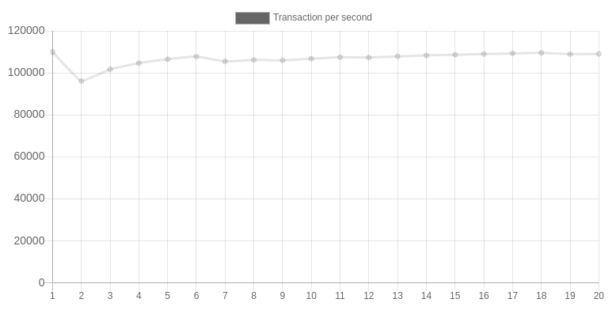

<sub>

[ENGLISH](README.md) |
[한국어](README.ko.md)

</sub>

__EVA <sup style="font-size: 0.8rem">EVENT LIB</sup>__
======================================================

> 에바(EVA)는 C 로 구현된 고성능의 네트워크 라이브러리입니다.


EVA 는 쉽게 고성능의 서버나 혹은 다중 클라이언트 어플리케이션을 쉽게 작성할 수 있는 라이브러리를 만드는 것이 목표입니다. 버전 0.0.1 은 TCP 에코 서버와 클라이언트를 20 줄 미만의 핸들러와 20줄 미만의 메인 함수를 정의하여 구현할 수 있습니다.

궁극적으로 이벤트 라이브러리를 만드는 것이 목적이며, 이 라이브러리를 통하여 쉽게 고성능의 네트워크 어플리케이션을 쉽게 만들 수 있도록 하려 합니다. 버전 0.0.1 은 리눅스 환경에서 동작하도록 하였고, 버전 1.0.0 은 UDP, 시그널, 잘 알려진 어플리케이션 프로토콜에 대한 지원 등을 계획하고 있습니다. 또한, 싱글 스레드 뿐만이 아닌 멀티 스레드를 지원하여 헤비한 작업의 경우에도 고성능을 보장하는 것이 쉽도록 구현할 것 입니다. 그 외에 UDP 기반으로 분산 네트워크 처리를 쉽게 할 수 있도록 하려 합니다.

## __성능 (버전 0.0.1 간단한 에코)__

간단한 6 바이트의 핑을 주고 받는 벤치마킹을 통하여 측정한 결과입니다. 테스트를 진행한 머신은 Acer Aspire V3-372 노트북이며, CPU 는 Intel(R) Core(TM) i5-6200U CPU @ 2.30GHz 4 코어입니다. 싱글스레드 환경에서 2,000,000 (2백만건) 트랙잭션을 처리하는데, 걸린 시간은 18.346731777 초이며, 초당 109011.241037887 건의 트랜잭션을 처리하였습니다.

<u>총 트랜잭션 수행 시간</u>

| SECOND       | TOTAL   |
| ------------ | ------- |
|  9.595638718 | 1000000 |
| 19.540924839 | 2000000 |
| 28.694509937 | 3000000 |
| 37.847823001 | 4000000 |

<u>__초당 트랜잭션__</u>



## __빌드방법__

```sh
$ ./configure
$ make
```
