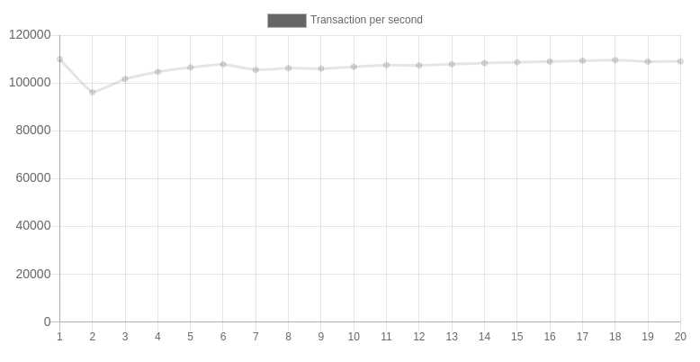

<sub>

[ENGLISH](README.md) |
[한국어](README.ko.md)

</sub>

__EVA <sup style="font-size: 0.8rem;">EVENT LIB</sup>__
========================================================


> ___"Eva" is a high-performance network library implemented in C.___

   

Eva aims to create a library that makes it easy to write high performance server on multi client applications. Version 0.0.1 allows tcp echo server anc client to be implemented by defining handlers less than 20 lines and main functions less than 20 lines.

Ultimately, the purpose of creating an event library is to make it easy to create high performance network applications throught this library. Version 0.0.1 is intended to run in a linux environment, and version 1.0.0 plans to support udp, signals and well known application protocols. In addition, by supporting mutl threading as well as single thread, we will implement it so that it is easy to guarantee high performance even in heavy work. In addition, we want to make it easy to process distributed networks based on udp.

## __PERFORMANCE (VERSION 0.0.1 BENCHMARK SIMPLE ECHO TRANSACTION)__

This is a measurement result through benchmarking that sends and receives a simple 6-byte ping. The machine tested was an Acer Aspire V3-372 laptop, the CPU is an Intel(R) Core(TM) i5-6200U CPU @ 2.30GHz. Processing 2,000,000 (2 million) transactions in a single threaded environment, took 18.346731777 seconds, and 109011.241037887 transactions per second.

### <u>__TOTAL TRANSACTION EXECUTION TIME__</u>

| SECOND       | TOTAL   |
| ------------ | ------- |
|  9.595638718 | 1000000 |
| 19.540924839 | 2000000 |
| 28.694509937 | 3000000 |
| 37.847823001 | 4000000 |

### <u>__TRANSACTIONS PER SECOND__</u>



## __BUILD__

```sh
$ ./configure
$ make
```
