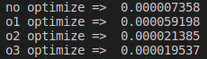

# GCC VERSION 9.3.0 의 최적화 옵션에 따른 STRLEN 의 성능 저하

최근에 Eva 라이브러리에 문자열 관련한 함수를 커스터마이징하여 기본 문자열 함수 이외에 특수한 함수들을 만들어 보려고 하고 있었는데, 특이한 케이스가 발생하였습니다. 최적화 옵션을 주고 STRLEN 과 제작한 XSTRINGLEN 함수를 같이 벤치마킹을 하면 STRLEN 함수가 20 혹은 60 나노초가 걸리고, STRLEN 함수만을 벤치마킹하면 약 10,000 나노초가 걸리는 것입니다. 같은 로직인데, 수행이 다르기에 디스어셈블리를 수행하여 체크를 해보니 20 ~ 60 나노초가 걸리는 케이스는 strlen 함수를 호출하고 그렇지 않고 많은 시간이 걸리는 strlen 함수 호출 구문은 최적화를 수행하여 glibc 의 strlen 함수를 호출하지 않는 코드가 컴파일 되었습니다. 그래서 각 최적화 옵션별로 테스트하여 보기로 하였고, 그 결과는 아래와 같습니다. 결과적은 최적화를 수행하지 않으면 코드가 더 빨리 수행되는 결과입니다. GCC 9.3 버전인데, 아마도 GCC로 컴파일시에 GLIBC 함수 호출하는 케이스의 경우 특히 헤비한 잡의 경우 최적화 옵션을 낮추어서 명시적으로 STRLEN 을 호출하도록 조심스럽게 코드를 작성해야 할 듯 보입니다. 특히 저의 개발 머신은 내부적으로 Advanced Vector Extensions 로 구현된 STRLEN 을 호출하는데, SIMD 혹은 AVX 를 호출하는 케이스의 경우 더욱 더 조심스럽게 GLIBC STRLEN 함수를 호출해야 핟 듯 보입니다.

> 테스트 홤경: gcc version 9.3.0 (Ubuntu 9.3.0-17ubuntu1~20.04)

__OUTPUT IMAGE__

__OUTPUT__

| OPTIMIZE    | SECOND      |
| ----------- | ----------- |
| no optimize | 0.000007358 |
| o1 optimize | 0.000059198 |
| o2 optimize | 0.000021385 |
| o3 optimize | 0.000019537 |

